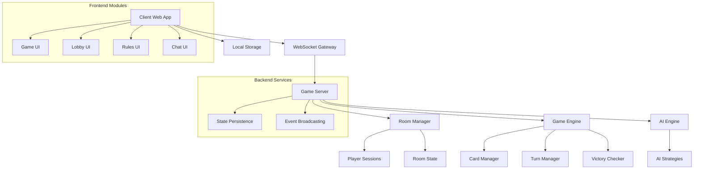
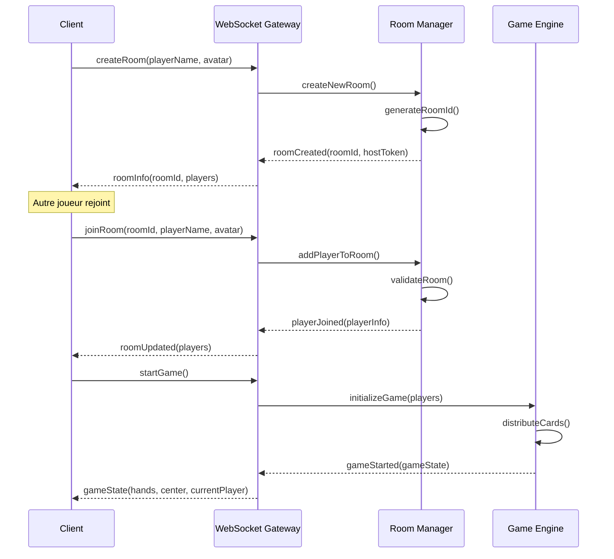
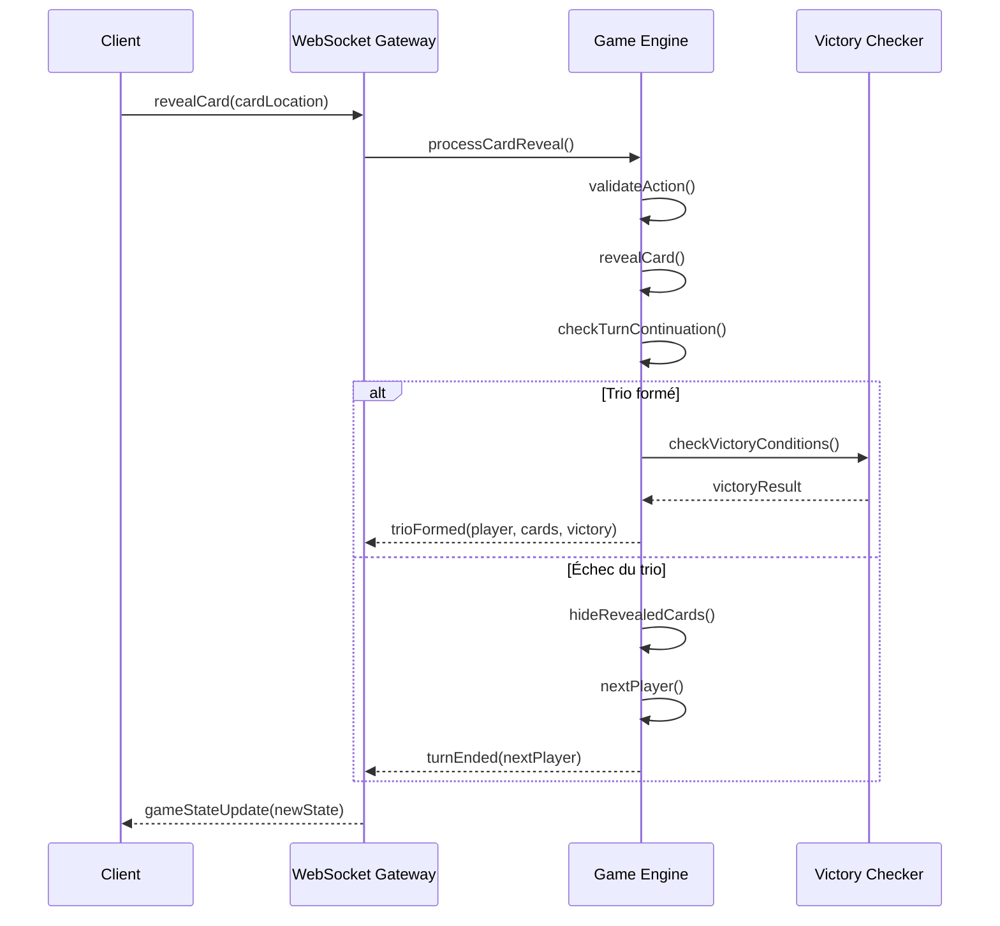

# Document de Conception : 3online

## Vue d'ensemble

3online est un jeu de cartes en ligne multijoueur inspiré de Trio (Cocktail Games), développé comme une application web temps réel. Le jeu permet à 2-6 joueurs de s'affronter en ligne ou contre des IA dans des parties tour par tour. L'objectif est de former des trios (3 cartes identiques) en révélant stratégiquement des cartes du centre ou des mains adverses.

Le système utilise une architecture client-serveur avec WebSockets pour les interactions temps réel, un moteur de jeu côté serveur pour garantir l'intégrité des règles, et une interface utilisateur moderne avec un thème violet/noir rétro. La conception privilégie la sécurité anti-triche, la fluidité des interactions, et une expérience utilisateur intuitive.

## Architecture



## Diagrammes de Séquence

### Flux de Création et Rejoindre une Partie



### Flux de Tour de Jeu


## Composants et Interfaces

### Composant 1: Game Engine

**Objectif**: Moteur central gérant la logique de jeu, les règles de Trio, et l'état des parties

**Interface**:
```pascal
INTERFACE GameEngine
  initializeGame(players: PlayerList): GameState
  processCardReveal(playerId: UUID, location: CardLocation): ActionResult
  validateAction(playerId: UUID, action: GameAction): Boolean
  checkVictoryConditions(playerId: UUID): VictoryResult
  getCurrentGameState(): GameState
  getValidActions(playerId: UUID): ActionList
END INTERFACE
```

**Responsabilités**:
- Distribution initiale des cartes selon le nombre de joueurs
- Validation des actions de révélation de cartes
- Gestion des tours et transitions entre joueurs
- Détection des trios et conditions de victoire
- Maintien de l'état de jeu cohérent

### Composant 2: Room Manager

**Objectif**: Gestion des salles de jeu, sessions joueurs, et matchmaking

**Interface**:
```pascal
INTERFACE RoomManager
  createRoom(hostPlayer: Player): RoomInfo
  joinRoom(roomId: UUID, player: Player): JoinResult
  leaveRoom(roomId: UUID, playerId: UUID): LeaveResult
  startGame(roomId: UUID, hostId: UUID): StartResult
  getRoomState(roomId: UUID): RoomState
  addAIPlayer(roomId: UUID, difficulty: AIDifficulty): AIPlayer
END INTERFACE
```

**Responsabilités**:
- Création et gestion du cycle de vie des salles
- Validation des joueurs et gestion des sessions
- Configuration des parties (nombre de joueurs, IA)
- Transition entre lobby et jeu actif

### Composant 3: AI Engine

**Objectif**: Intelligence artificielle pour les joueurs virtuels avec différents niveaux

**Interface**:
```pascal
INTERFACE AIEngine
  makeDecision(gameState: GameState, aiPlayer: AIPlayer): GameAction
  updateMemory(aiPlayer: AIPlayer, revealedCard: Card): Void
  setDifficulty(aiPlayer: AIPlayer, level: AIDifficulty): Void
  analyzeGameState(gameState: GameState): GameAnalysis
END INTERFACE
```

**Responsabilités**:
- Prise de décision automatique pour les joueurs IA
- Mémorisation des cartes révélées et stratégies
- Adaptation du niveau de difficulté
- Simulation de comportement humain réaliste

### Composant 4: WebSocket Gateway

**Objectif**: Gestion des communications temps réel entre clients et serveur

**Interface**:
```pascal
INTERFACE WebSocketGateway
  broadcastToRoom(roomId: UUID, event: GameEvent): Void
  sendToPlayer(playerId: UUID, event: GameEvent): Void
  handlePlayerAction(playerId: UUID, action: PlayerAction): Void
  manageConnection(socket: WebSocket, playerId: UUID): Void
  handleDisconnection(playerId: UUID): Void
END INTERFACE
```

**Responsabilités**:
- Diffusion des événements de jeu en temps réel
- Gestion des connexions et déconnexions
- Routage des actions joueurs vers les composants appropriés
- Maintien de la synchronisation état client-serveur

## Modèles de Données

### Modèle 1: GameState

```pascal
STRUCTURE GameState
  gameId: UUID
  roomId: UUID
  players: Array[Player]
  centerCards: Array[Card]
  currentPlayerId: UUID
  turnPhase: TurnPhase
  revealedCards: Array[RevealedCard]
  gameStatus: GameStatus
  startTime: Timestamp
  lastActionTime: Timestamp
END STRUCTURE
```

**Règles de Validation**:
- gameId et roomId doivent être des UUID valides
- players doit contenir 2-6 joueurs
- currentPlayerId doit correspondre à un joueur actif
- centerCards respecte la distribution selon nombre de joueurs

### Modèle 2: Player

```pascal
STRUCTURE Player
  id: UUID
  name: String
  avatar: AvatarType
  hand: Array[Card]
  trios: Array[Trio]
  isAI: Boolean
  aiDifficulty: AIDifficulty
  connectionStatus: ConnectionStatus
  score: PlayerScore
END STRUCTURE
```

**Règles de Validation**:
- name doit être non-vide et unique dans la salle
- hand contient le nombre correct de cartes selon les règles
- trios contient uniquement des trios valides (3 cartes identiques)

### Modèle 3: Card

```pascal
STRUCTURE Card
  id: UUID
  number: Integer
  isRevealed: Boolean
  location: CardLocation
  revealedBy: UUID
  revealOrder: Integer
END STRUCTURE

ENUMERATION CardLocation
  CENTER
  PLAYER_HAND
  TRIO_PILE
END ENUMERATION
```

**Règles de Validation**:
- number doit être entre 1 et 12
- location doit correspondre à la position réelle de la carte
- revealedBy doit être un UUID de joueur valide si isRevealed = true

### Modèle 4: GameAction

```pascal
STRUCTURE GameAction
  actionId: UUID
  playerId: UUID
  actionType: ActionType
  targetCard: CardReference
  timestamp: Timestamp
  isValid: Boolean
END STRUCTURE

ENUMERATION ActionType
  REVEAL_CENTER_CARD
  REVEAL_PLAYER_SMALLEST
  REVEAL_PLAYER_LARGEST
  END_TURN
END ENUMERATION
```

**Règles de Validation**:
- actionType doit correspondre aux actions autorisées selon les règles
- targetCard doit référencer une carte existante et accessible
- timestamp doit être dans une fenêtre de temps valide
## Pseudocode Algorithmique

### Algorithme Principal : Traitement d'un Tour de Jeu

```pascal
ALGORITHM processPlayerTurn(gameState, playerId, action)
INPUT: gameState de type GameState, playerId de type UUID, action de type GameAction
OUTPUT: result de type TurnResult

PRECONDITIONS:
  gameState.currentPlayerId = playerId
  action.playerId = playerId
  gameState.gameStatus = ACTIVE
  validateAction(playerId, action) = true

BEGIN
  ASSERT gameState.currentPlayerId = playerId
  
  // Étape 1: Révéler la carte demandée
  targetCard ← getCard(action.targetCard)
  revealCard(targetCard, playerId)
  gameState.revealedCards.add(targetCard)
  
  // Étape 2: Vérifier la formation d'un trio
  revealedNumbers ← extractNumbers(gameState.revealedCards)
  
  IF allSameNumber(revealedNumbers) AND length(revealedNumbers) = 3 THEN
    // Trio formé avec succès
    trio ← createTrio(gameState.revealedCards)
    player ← getPlayer(playerId)
    player.trios.add(trio)
    
    // Vérifier conditions de victoire
    victoryResult ← checkVictoryConditions(player)
    
    IF victoryResult.hasWon THEN
      gameState.gameStatus ← FINISHED
      gameState.winner ← playerId
      RETURN TurnResult(VICTORY, trio, victoryResult)
    ELSE
      // Continuer le tour du même joueur
      clearRevealedCards(gameState)
      RETURN TurnResult(TRIO_SUCCESS, trio, null)
    END IF
    
  ELSE IF hasTwoConsecutiveDifferentNumbers(revealedNumbers) THEN
    // Échec du trio - fin du tour
    hideAllRevealedCards(gameState)
    clearRevealedCards(gameState)
    nextPlayer ← getNextPlayer(gameState)
    gameState.currentPlayerId ← nextPlayer.id
    RETURN TurnResult(TURN_END, null, null)
    
  ELSE
    // Continuer à révéler des cartes
    RETURN TurnResult(CONTINUE_TURN, null, null)
  END IF
  
  ASSERT gameState.isConsistent()
END

POSTCONDITIONS:
  result.type ∈ {VICTORY, TRIO_SUCCESS, TURN_END, CONTINUE_TURN}
  IF result.type = VICTORY THEN gameState.gameStatus = FINISHED
  IF result.type = TURN_END THEN gameState.currentPlayerId ≠ playerId
  gameState.revealedCards.isEmpty() OR result.type = CONTINUE_TURN

LOOP INVARIANTS: N/A (pas de boucles dans cet algorithme)
```

### Algorithme : Vérification des Conditions de Victoire

```pascal
ALGORITHM checkVictoryConditions(player)
INPUT: player de type Player
OUTPUT: victoryResult de type VictoryResult

PRECONDITIONS:
  player ≠ null
  player.trios est une liste valide

BEGIN
  trioCount ← length(player.trios)
  
  // Condition 1: Trio de 7 (victoire immédiate)
  FOR each trio IN player.trios DO
    IF trio.number = 7 THEN
      RETURN VictoryResult(true, TRIO_SEVEN, trio)
    END IF
  END FOR
  
  // Condition 2: 3 trios quelconques
  IF trioCount ≥ 3 THEN
    RETURN VictoryResult(true, THREE_TRIOS, player.trios)
  END IF
  
  // Condition 3: 2 trios liés (numéros consécutifs)
  IF trioCount ≥ 2 THEN
    FOR i ← 0 TO trioCount-2 DO
      FOR j ← i+1 TO trioCount-1 DO
        trio1 ← player.trios[i]
        trio2 ← player.trios[j]
        IF abs(trio1.number - trio2.number) = 1 THEN
          RETURN VictoryResult(true, LINKED_TRIOS, [trio1, trio2])
        END IF
      END FOR
    END FOR
  END IF
  
  // Aucune condition de victoire remplie
  RETURN VictoryResult(false, NONE, null)
END

POSTCONDITIONS:
  result.hasWon ⟹ result.condition ≠ NONE
  result.hasWon ⟹ result.evidence ≠ null
  ¬result.hasWon ⟹ result.condition = NONE

LOOP INVARIANTS:
  Boucle externe: tous les trios précédemment vérifiés ne contiennent pas le numéro 7
  Boucle imbriquée: toutes les paires précédentes ne sont pas liées
```

### Algorithme : Distribution Initiale des Cartes

```pascal
ALGORITHM distributeCards(players)
INPUT: players de type Array[Player]
OUTPUT: distribution de type CardDistribution

PRECONDITIONS:
  length(players) ∈ {2, 3, 4, 5, 6}
  ∀ player ∈ players: player.hand.isEmpty()

BEGIN
  playerCount ← length(players)
  deck ← createFullDeck() // 36 cartes: 3 exemplaires de chaque numéro 1-12
  shuffleDeck(deck)
  
  // Déterminer le nombre de cartes par joueur selon les règles
  cardsPerPlayer ← CASE playerCount OF
    2: 15  // Mode spécial 2 joueurs
    3: 9
    4: 7
    5: 6
    6: 5
  END CASE
  
  // Distribuer les cartes aux joueurs
  cardIndex ← 0
  FOR each player IN players DO
    ASSERT player.hand.isEmpty()
    
    FOR i ← 1 TO cardsPerPlayer DO
      card ← deck[cardIndex]
      card.location ← PLAYER_HAND
      card.isRevealed ← false
      player.hand.add(card)
      cardIndex ← cardIndex + 1
    END FOR
    
    // Trier la main du joueur par numéro
    sortHand(player.hand)
  END FOR
  
  // Placer les cartes restantes au centre
  centerCards ← Array()
  WHILE cardIndex < length(deck) DO
    card ← deck[cardIndex]
    card.location ← CENTER
    card.isRevealed ← false
    centerCards.add(card)
    cardIndex ← cardIndex + 1
  END WHILE
  
  RETURN CardDistribution(players, centerCards)
END

POSTCONDITIONS:
  ∀ player ∈ players: length(player.hand) = cardsPerPlayer
  length(centerCards) = 36 - (playerCount × cardsPerPlayer)
  ∀ card ∈ allCards: card.location ∈ {PLAYER_HAND, CENTER}
  totalCardsDistributed = 36

LOOP INVARIANTS:
  Boucle joueurs: cardIndex = nombre de cartes déjà distribuées
  Boucle centre: toutes les cartes restantes sont assignées au centre
```

## Fonctions Clés avec Spécifications Formelles

### Fonction 1: validateAction()

```pascal
FUNCTION validateAction(playerId: UUID, action: GameAction): Boolean
```

**Préconditions:**
- playerId est un UUID valide d'un joueur actif
- action est une structure GameAction bien formée
- Le jeu est dans un état ACTIVE

**Postconditions:**
- Retourne true si et seulement si l'action est légale selon les règles
- Aucune modification de l'état de jeu
- L'action respecte les contraintes de révélation (pas de carte "du milieu")

**Invariants de Boucle:** N/A (pas de boucles)

### Fonction 2: getValidActions()

```pascal
FUNCTION getValidActions(gameState: GameState, playerId: UUID): Array[GameAction]
```

**Préconditions:**
- gameState est cohérent et valide
- playerId correspond au joueur dont c'est le tour
- gameState.gameStatus = ACTIVE

**Postconditions:**
- Retourne la liste complète des actions légales pour le joueur
- Chaque action retournée passe validateAction()
- La liste n'est jamais vide (au minimum une action possible)

**Invariants de Boucle:**
- Pour chaque carte évaluée: l'action générée respecte les règles de révélation
- Toutes les actions précédemment ajoutées restent valides

### Fonction 3: processAITurn()

```pascal
FUNCTION processAITurn(gameState: GameState, aiPlayer: AIPlayer): GameAction
```

**Préconditions:**
- aiPlayer.isAI = true
- gameState.currentPlayerId = aiPlayer.id
- aiPlayer a une stratégie configurée

**Postconditions:**
- Retourne une action valide selon validateAction()
- L'action respecte le niveau de difficulté de l'IA
- Le temps de réflexion simule un comportement humain

**Invariants de Boucle:**
- Boucle d'évaluation: toutes les options considérées sont légales
- Boucle de mémorisation: l'état de la mémoire IA reste cohérent
## Exemples d'Utilisation

```pascal
// Exemple 1: Création et démarrage d'une partie
roomManager ← new RoomManager()
gameEngine ← new GameEngine()

// Créer une salle
host ← Player("Alice", AVATAR_1, false)
room ← roomManager.createRoom(host)

// Ajouter des joueurs
player2 ← Player("Bob", AVATAR_2, false)
aiPlayer ← Player("AI_Easy", AVATAR_3, true)
roomManager.joinRoom(room.id, player2)
roomManager.addAIPlayer(room.id, EASY)

// Démarrer la partie
gameState ← gameEngine.initializeGame([host, player2, aiPlayer])
distribution ← distributeCards(gameState.players)

// Exemple 2: Traitement d'un tour de jeu
action ← GameAction(UUID(), host.id, REVEAL_CENTER_CARD, centerCards[0])
IF validateAction(host.id, action) THEN
  result ← processPlayerTurn(gameState, host.id, action)
  
  CASE result.type OF
    VICTORY: broadcastVictory(room.id, host, result.evidence)
    TRIO_SUCCESS: broadcastTrioFormed(room.id, host, result.trio)
    TURN_END: broadcastTurnChange(room.id, gameState.currentPlayerId)
    CONTINUE_TURN: broadcastCardRevealed(room.id, action.targetCard)
  END CASE
END IF

// Exemple 3: Gestion d'un tour IA
IF gameState.currentPlayer.isAI THEN
  aiAction ← processAITurn(gameState, gameState.currentPlayer)
  result ← processPlayerTurn(gameState, gameState.currentPlayer.id, aiAction)
  // Diffuser le résultat avec un délai pour simuler la réflexion
  scheduleDelayedBroadcast(result, calculateAIDelay(gameState.currentPlayer.aiDifficulty))
END IF
```

## Propriétés de Correction

*Une propriété est une caractéristique ou un comportement qui doit être vrai dans toutes les exécutions valides d'un système - essentiellement, une déclaration formelle sur ce que le système devrait faire. Les propriétés servent de pont entre les spécifications lisibles par l'homme et les garanties de correction vérifiables par machine.*

### Propriété 1: Intégrité des Cartes

*Pour tout* état de jeu actif, le système doit maintenir exactement 36 cartes avec 3 exemplaires de chaque numéro de 1 à 12, sans duplication ni perte de cartes.

**Valide: Exigences 14.1, 14.2, 14.3**

### Propriété 2: Cohérence des Tours

*Pour tout* état de jeu, un seul joueur doit être actif à la fois et toutes les cartes révélées doivent appartenir au tour actuel avec un ordre cohérent.

**Valide: Exigences 5.1, 6.5**

### Propriété 3: Validité des Trios

*Pour tout* trio formé par un joueur, les trois cartes doivent avoir le même numéro et aucune carte ne peut appartenir à plusieurs trios simultanément.

**Valide: Exigences 6.1, 14.4**

### Propriété 4: Conditions de Victoire

*Pour toute* partie terminée, exactement une condition de victoire doit être remplie : trio de 7, trois trios quelconques, ou deux trios de numéros consécutifs.

**Valide: Exigences 7.1, 7.2, 7.3**

### Propriété 5: Distribution des Cartes

*Pour toute* partie démarrée, les cartes doivent être distribuées selon le nombre de joueurs avec les cartes restantes placées au centre.

**Valide: Exigences 3.2, 3.3**

### Propriété 6: Unicité des Identifiants

*Pour toute* salle créée, l'identifiant généré doit être unique et le créateur doit être assigné comme hôte.

**Valide: Exigences 1.1, 1.2**

### Propriété 7: Actions Valides Seulement

*Pour toute* action de jeu reçue, si elle est invalide selon les règles, elle doit être rejetée sans modifier l'état de jeu.

**Valide: Exigences 5.5, 11.2**

### Propriété 8: Révélation de Cartes Correcte

*Pour toute* demande de révélation de la plus petite ou plus grande carte d'un adversaire, la carte révélée doit effectivement être la valeur minimale ou maximale de sa main.

**Valide: Exigences 5.3, 5.4**

### Propriété 9: Synchronisation Temps Réel

*Pour tout* changement d'état de jeu, tous les joueurs de la salle doivent recevoir la mise à jour dans les 300ms.

**Valide: Exigences 9.1, 9.2**

### Propriété 10: Gestion des Déconnexions

*Pour tout* joueur déconnecté, son état doit être maintenu pendant 30 secondes pour permettre la reconnexion.

**Valide: Exigences 9.5, 11.1**

## Gestion des Erreurs

### Scénario d'Erreur 1: Déconnexion de Joueur

**Condition**: Un joueur perd sa connexion WebSocket pendant une partie active
**Réponse**: 
- Marquer le joueur comme déconnecté mais maintenir son état dans la partie
- Si c'est le tour du joueur déconnecté, démarrer un timer de grâce (30 secondes)
- Permettre la reconnexion avec restauration de l'état complet
**Récupération**: 
- Reconnexion automatique avec token de session
- Si le timer expire, passer au joueur suivant ou remplacer par IA temporaire

### Scénario d'Erreur 2: Action Invalide

**Condition**: Un client envoie une action qui ne respecte pas les règles du jeu
**Réponse**:
- Rejeter l'action côté serveur avec un message d'erreur explicite
- Renvoyer l'état de jeu correct au client pour resynchronisation
- Logger l'incident pour détecter les tentatives de triche
**Récupération**:
- Le client doit se resynchroniser avec l'état serveur
- Afficher un message d'erreur à l'utilisateur si nécessaire

### Scénario d'Erreur 3: Corruption d'État de Jeu

**Condition**: L'état de jeu devient incohérent (cartes dupliquées, trios invalides)
**Réponse**:
- Détecter l'incohérence via les propriétés de correction
- Suspendre la partie et notifier tous les joueurs
- Sauvegarder l'état corrompu pour analyse
**Récupération**:
- Proposer de redémarrer la partie avec les mêmes joueurs
- Implémenter des points de contrôle pour restaurer un état antérieur valide

## Stratégie de Test

### Approche de Tests Unitaires

Les tests unitaires couvrent chaque composant individuellement avec des mocks pour les dépendances. Focus sur la logique métier pure (GameEngine, règles de Trio, validation des actions) avec une couverture de 95% minimum. Tests de régression pour chaque bug découvert.

### Approche de Tests Basés sur les Propriétés

**Bibliothèque de Test de Propriétés**: fast-check (JavaScript/TypeScript)

**Propriétés Testées**:
- Intégrité des cartes après toute séquence d'actions valides
- Cohérence de l'état de jeu après distribution et mélange aléatoires
- Validité des conditions de victoire pour toute configuration de trios
- Invariants de tour maintenues après actions de révélation aléatoires

**Générateurs de Données**:
- États de jeu aléatoires mais valides
- Séquences d'actions de joueurs
- Configurations de cartes et distributions
- Scénarios de déconnexion/reconnexion

### Approche de Tests d'Intégration

Tests end-to-end simulant des parties complètes avec plusieurs clients WebSocket. Validation des flux temps réel, synchronisation état client-serveur, et comportement des IA. Tests de charge avec 6 joueurs simultanés et latence réseau simulée.

## Considérations de Performance

**Objectifs de Performance**:
- Latence < 300ms pour toute action de jeu
- Support de 50 parties simultanées minimum
- Temps de réponse IA < 2 secondes (niveau difficile)
- Mémoire serveur < 100MB par partie active

**Optimisations**:
- Cache en mémoire pour les états de jeu actifs
- Compression des messages WebSocket
- Algorithmes IA optimisés avec élagage alpha-beta
- Garbage collection proactive des parties terminées

## Considérations de Sécurité

**Modèle de Menaces**:
- Triche par manipulation des messages WebSocket
- Exploitation des failles de validation côté client
- Attaques par déni de service sur les WebSockets
- Injection de code via les noms de joueurs

**Mesures de Mitigation**:
- Validation stricte côté serveur pour toutes les actions
- Rate limiting sur les connexions et messages
- Sanitisation des entrées utilisateur
- Chiffrement TLS pour toutes les communications
- Tokens de session avec expiration automatique

## Dépendances

**Frontend**:
- React 18+ ou Vue 3+ (framework SPA)
- Socket.io-client (WebSocket avec fallbacks)
- CSS-in-JS ou Tailwind CSS (styling)
- Vite ou Webpack (bundling)

**Backend**:
- Node.js 18+ avec Express ou Fastify
- Socket.io (WebSocket serveur)
- UUID v4 (génération d'identifiants)
- Jest ou Vitest (tests)
- fast-check (property-based testing)

**Infrastructure**:
- Redis (optionnel, pour persistance sessions)
- Docker (containerisation)
- Nginx (reverse proxy, fichiers statiques)
- Monitoring: Prometheus + Grafana (optionnel)