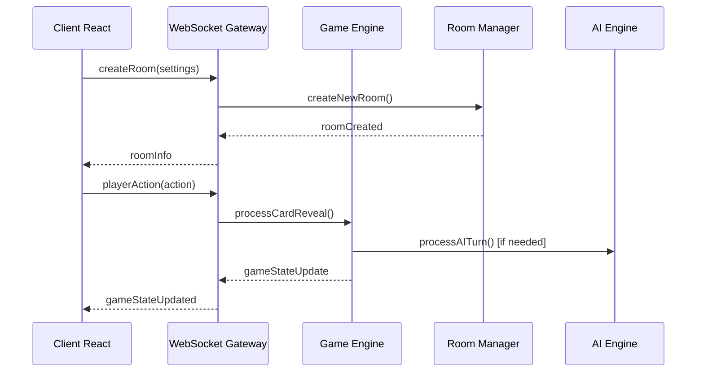

# Guide de Développement - 3online

## Architecture du Projet

### Structure Monorepo

Le projet utilise une architecture monorepo avec npm workspaces :

```
3online/
├── packages/
│   ├── client/          # Application React (Frontend)
│   ├── server/          # Serveur Node.js (Backend)
│   └── shared/          # Types et utilitaires partagés
├── docs/               # Documentation
└── .kiro/             # Spécifications Kiro
```

### Technologies Utilisées

- **TypeScript** : Langage principal pour la sécurité des types
- **React 18** : Framework frontend avec hooks modernes
- **Node.js** : Runtime serveur
- **Socket.IO** : Communication temps réel WebSocket
- **Vite** : Bundler moderne pour le développement rapide
- **Vitest** : Framework de test rapide

## Flux de Données

### Communication Client-Serveur



### État du Jeu

L'état du jeu est géré de manière centralisée :

1. **Serveur** : Source de vérité (GameState)
2. **Client** : État dérivé pour l'affichage (GameContext)
3. **Synchronisation** : Via événements WebSocket

## Composants Principaux

### Backend (packages/server/)

#### GameEngine
- **Responsabilité** : Logique de jeu Trio
- **Méthodes clés** :
  - `initializeGame()` : Initialise une nouvelle partie
  - `processCardReveal()` : Traite les révélations de cartes
  - `validateAction()` : Valide les actions des joueurs

#### RoomManager
- **Responsabilité** : Gestion des salles multijoueur
- **Méthodes clés** :
  - `createRoom()` : Crée une nouvelle salle
  - `joinRoom()` : Fait rejoindre un joueur
  - `addAIPlayer()` : Ajoute une IA

#### AIEngine
- **Responsabilité** : Intelligence artificielle
- **Niveaux** : Facile, Normal, Difficile
- **Stratégies** : Mémorisation, agressivité, patience

#### WebSocketGateway
- **Responsabilité** : Communication temps réel
- **Événements** : Diffusion vers salles et joueurs individuels

### Frontend (packages/client/)

#### GameContext
- **Responsabilité** : État global de l'application
- **Gestion** : WebSocket, état des salles, état du jeu

#### Composants React
- `MainMenu` : Menu principal et sélection joueur
- `GameLobby` : Création/jointure de salles
- `GameBoard` : Interface de jeu principale
- `Rules` : Affichage des règles

### Shared (packages/shared/)

#### Types TypeScript
- Interfaces communes client/serveur
- Énumérations pour les états du jeu
- Types pour WebSocket et validation

#### Utilitaires
- Fonctions de validation
- Helpers pour la logique de jeu
- Constantes de configuration

## Règles de Développement

### Conventions de Code

1. **TypeScript strict** : Tous les fichiers en TypeScript
2. **Interfaces explicites** : Typage fort pour toutes les données
3. **Validation** : Côté serveur pour toutes les entrées
4. **Immutabilité** : Éviter les mutations directes d'état

### Structure des Fichiers

```typescript
// Exemple de structure de composant
import React from 'react'
import { useGame } from '../contexts/GameContext'
import './Component.css'

interface ComponentProps {
  // Props typées
}

const Component: React.FC<ComponentProps> = ({ }) => {
  // Logique du composant
  return (
    <div className="component">
      {/* JSX */}
    </div>
  )
}

export default Component
```

### Gestion d'État

#### Côté Client (React)
```typescript
// Utilisation du contexte
const { state, sendGameAction } = useGame()

// Actions typées
const handleAction = async () => {
  try {
    await sendGameAction(action)
  } catch (error) {
    // Gestion d'erreur
  }
}
```

#### Côté Serveur (Node.js)
```typescript
// Validation puis traitement
const validation = validateGameAction(action)
if (!validation.isValid) {
  return { success: false, message: validation.errors.join(', ') }
}

const result = gameEngine.processCardReveal(gameId, playerId, action)
```

## Tests

### Types de Tests

1. **Tests unitaires** : Fonctions individuelles
2. **Tests d'intégration** : Composants connectés
3. **Tests de propriétés** : Invariants du jeu (optionnel)

### Exécution des Tests

```bash
# Tous les tests
npm run test

# Tests d'un package spécifique
npm run test --workspace=packages/shared

# Tests en mode watch
npm run test -- --watch
```

### Exemple de Test

```typescript
import { describe, it, expect } from 'vitest'
import { checkVictoryConditions } from './helpers'

describe('Victory Conditions', () => {
  it('should detect trio of 7', () => {
    const player = createPlayerWithTrios([7])
    const result = checkVictoryConditions(player)
    
    expect(result.hasWon).toBe(true)
    expect(result.condition).toBe('TRIO_SEVEN')
  })
})
```

## Débogage

### Outils de Développement

1. **Console serveur** : Logs détaillés des actions
2. **DevTools React** : État des composants
3. **Network tab** : Événements WebSocket
4. **TypeScript** : Erreurs de compilation

### Logs Utiles

```typescript
// Côté serveur
console.log('Action reçue:', action)
console.log('État du jeu:', gameState)

// Côté client
console.log('État du contexte:', state)
console.log('Événement WebSocket:', event)
```

## Performance

### Optimisations Implémentées

1. **Memoization React** : Éviter les re-renders inutiles
2. **WebSocket efficace** : Événements ciblés par salle
3. **Validation côté serveur** : Sécurité et cohérence
4. **Cleanup automatique** : Nettoyage des ressources

### Métriques à Surveiller

- Temps de réponse des actions (< 300ms)
- Utilisation mémoire serveur
- Nombre de connexions WebSocket actives
- Taille des messages échangés

## Sécurité

### Mesures Implémentées

1. **Validation serveur** : Toutes les actions validées
2. **Anti-triche** : Pas d'info sensible côté client
3. **Rate limiting** : Protection contre le spam
4. **Sanitisation** : Nettoyage des entrées utilisateur

### Bonnes Pratiques

- Jamais de logique critique côté client
- Validation de tous les paramètres
- Gestion des erreurs explicite
- Logs de sécurité pour audit

## Déploiement

### Environnements

1. **Développement** : `npm run dev`
2. **Production** : `npm run build && npm start`

### Variables d'Environnement

```bash
# Serveur
PORT=3001
CLIENT_URL=http://localhost:5173
NODE_ENV=production

# Client
VITE_SERVER_URL=http://localhost:3001
```

### Build de Production

```bash
# Build complet
npm run build

# Vérification des types
npm run type-check

# Tests avant déploiement
npm run test
```

## Contribution

### Workflow Git

1. Créer une branche feature
2. Développer avec tests
3. Vérifier TypeScript et tests
4. Pull Request avec description

### Standards de Code

- ESLint configuré pour TypeScript
- Prettier pour le formatage
- Commits conventionnels recommandés
- Documentation des nouvelles fonctionnalités

## Ressources

- [Documentation React](https://react.dev/)
- [Socket.IO Guide](https://socket.io/docs/)
- [TypeScript Handbook](https://www.typescriptlang.org/docs/)
- [Vitest Documentation](https://vitest.dev/)
- [Règles de Trio](https://www.cocktailgames.com/jeu/trio/)